# Workshop Manage your geospatial data with PostgreSQL/PostGIS

[FOSS4G 2022 Workshop Firenze (Italy)](https://2022.foss4g.org/)

 


[](https://creativecommons.org/licenses/by-sa/4.0/deed.de)


## Astrid Emde

* WhereGroup GmbH Germany
* astrid.emde@wheregroup.com
* [](https://twitter.com/astroidex) [@astroidex](https://twitter.com/astroidex)


* FOSS Academy https://www.foss-academy.com/


## With support from 

* Hannes Kröger WhereGroup @cartocalypse
* Enock Seth Nyamador @Enock4seth


## What we learn 
* Why database?
* PostgreSQL / PostGIS
* SQL Basics
* Import data / Export data
* Spatial Functions
* Spatial Index
* Roles & handle access to your data


## OSGeoLive


This Workshop uses the brand new OSGeoLive 15 rc1 (https://live.osgeo.org) (Release August 2022). OSGeoLive is based on Lubuntu 22.04 and contains a collection of more than 50 pre-installed software projects. OSGeoLive also contains example data which will be used for the workshop.

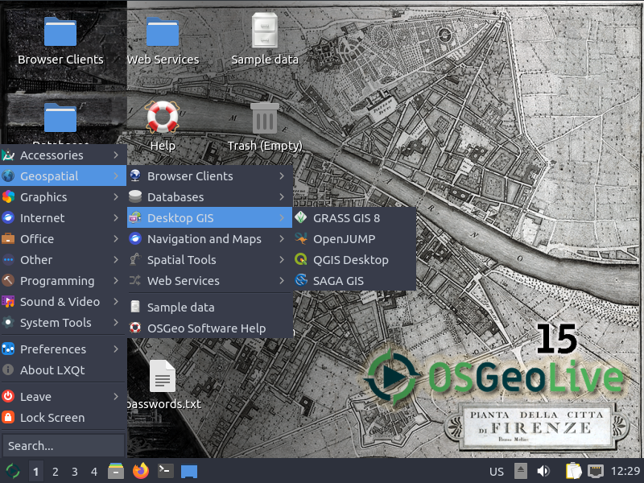

You can download OSGeoLive with the following link. You can install OSGeoLive, run it in a virtual machine (recommended) or use it on an USB stick.

For the conference you can use 15 rc1
* Download of OSGeoLive Version 15 rc1: http://download.osgeo.org/livedvd/releases/15.0/ (if possible take the vmdk with more programs, else use the iso)
* Documentation for Version 15 https://osgeo.github.io/OSGeoLive-doc/en/ 

FInal Version 15 will be available in September 2022
* Download OSGeoLive Image http://live.osgeo.org/en/download.html
* Documentation https://live.osgeo.org/
* PostGIS Overview (OSGeoLive Overview) https://live.osgeo.org/en/overview/postgis_overview.html
* PostGIS Quickstart (OSGeoLive Quickstart) https://live.osgeo.org/en/quickstart/postgis_quickstart.html


## Actual Software Versions

* PostgreSQL 14.5 (2022-08-11) https://www.postgresql.org/
* PostGIS 3.2.3 (2022-08-18) https://postgis.net/


### OSGeoLive 15.0

* PostgreSQL 14.4
* PostGIS 3.2.0

```sql
SELECT version(), postgis_version(), postgis_full_version();
```

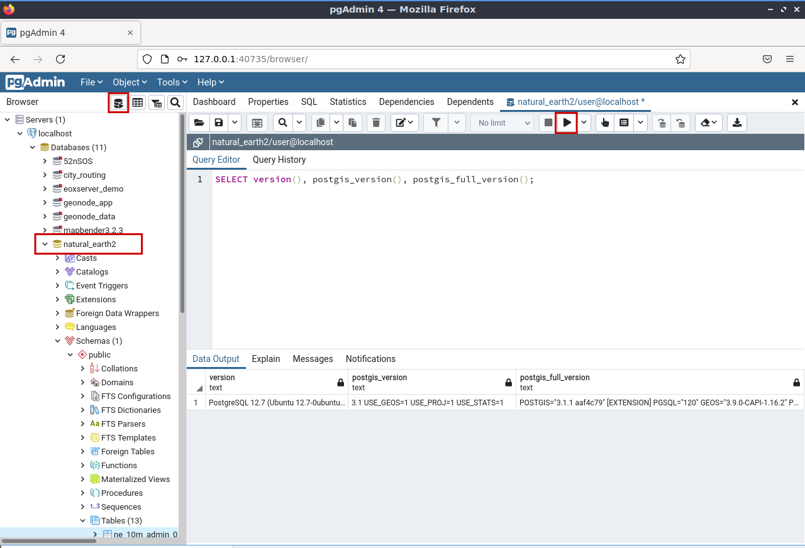


## Data

* Natural Earth
 * as ESRI Shapes - countries, provinces, rivers, populated places & more at /home/user/data
 * database: natural_earth2
* OpenStreetMap
 * database: osm_local


## Additional information

* PostGIS in Action (August 2015, 2. Auflage) Regine Obe, Leo Hsu ISBN 9781617291395
* Paul Ramsey PostGIS Day 20019 - Everything about PostGIS https://www.youtube.com/watch?v=g4DgAVCmiDE
* Paul Ramsey Blog Clever Elephant http://blog.cleverelephant.ca/
* MapScaping Podcast Paul Ramsey Spatial SQL - GIS without the GIS https://mapscaping.com/blogs/the-mapscaping-podcast/spatial-sql-gis-without-the-gis
* Clever Elephant ;) https://www.youtube.com/watch?v=Gw_Q1JClH58
* Postgres OnLine Journal Regine Obe, Leo Hsu http://www.postgresonline.com/
* Modern SQL Blog Markus Winand https://modern-sql.com/slides https://use-the-index-luke.com/
* PostgreSQL books https://www.postgresql.org/docs/books/
* Geomob Podcast - 88. Paul Ramsey: PostGIS turns 20 https://thegeomob.com/podcast/episode-88
* PostGIS at 20, The Beginning Paul Ramsey: http://blog.cleverelephant.ca/2021/05/postgis-20-years.html
* FOSSGIS 2021 20 Jahre PostGIS - dazu 20 hilfreiche Tipps zu PostGIS und Neuigkeiten rund um das Projekt (Astrid Emde, german) https://pretalx.com/fossgis2021/talk/NL3FAN/
* FOSSGIS 2020 Verbindungen schaffen mit PostgreSQL Foreign Data Wrappern (Astrid Emde, german) https://pretalx.com/fossgis2020/talk/ZP3JZZ/
* pgRouting: A Practical Guide (Mai 2017, 2. Auflage) Regine Obe, Leo Hsu ISBN: 9780989421737
* Find the right projection http://spatialreference.org/


## Why database?

* central storage of data - no data redundancy
* consistency of data
* multi-user access
* restricted access via access control and access management
* access your data via different tools
* combine different data and use SQL to explore and analyze
* backup, replication ...


## PostgreSQL

* supported by several other programs
* fast, powerful, reliable, robust
* easy to maintain
* follows SQL standard
* API to many programming languages
* subselects, functions, trigger, Foreign Data Wrapper, replication & more
* https://www.postgresql.org/about/


## PostGIS

* Extension for PostgreSQL
* let PostGIS do the work - not your Desktop GIS
* Follows standard - OGC Simple Feature Spezification for SQL and OGC ISO SQL/MM Spezification 
* Provides many spatial functions
* Widley supported by other programs
* Easy import / export of spatial data (QGIS, shp2pgsql, pgsql2shp, ogr2ogr, dxf2postgis, osm2pgsql, imposm)
* Can use the advantages from PostgreSQL (user management, replication, indexing & more)
* Very powerful: vector & raster data, geometry (planar) and geography (spheroid), circular objects, 3D, 4D, point cloud, pg_routing for routing, topology
* Stores data as WKB (Well-known Binary) and displays it as WKT (Well-known text)
* http://postgis.net/
* http://postgis.net/docs/


PostGIS turned 20 on 21. May 2021!


Do not miss PostGIS day!
* https://twitter.com/search?q=PostGISDay


## Database Clients

* pgAdmin 4 https://www.pgadmin.org/
* psql command line client https://www.postgresql.org/docs/current/static/app-psql.html
* QGIS DB Manager integrated in QGIS
* DBeaver https://dbeaver.io/
* and many other


### Excercise 1: pgAdmin & first steps in the database

1. Open pgAdmin
2. Connect to database natural_earth2
3. Go to schema public and look for tables
4. Open a table and look for the geometry column. Can you read the geometry?
5. Open table spatial_ref_sys and filter by srid = 4326
7. Go to schema public -> views and open the metadata view geometry_columns

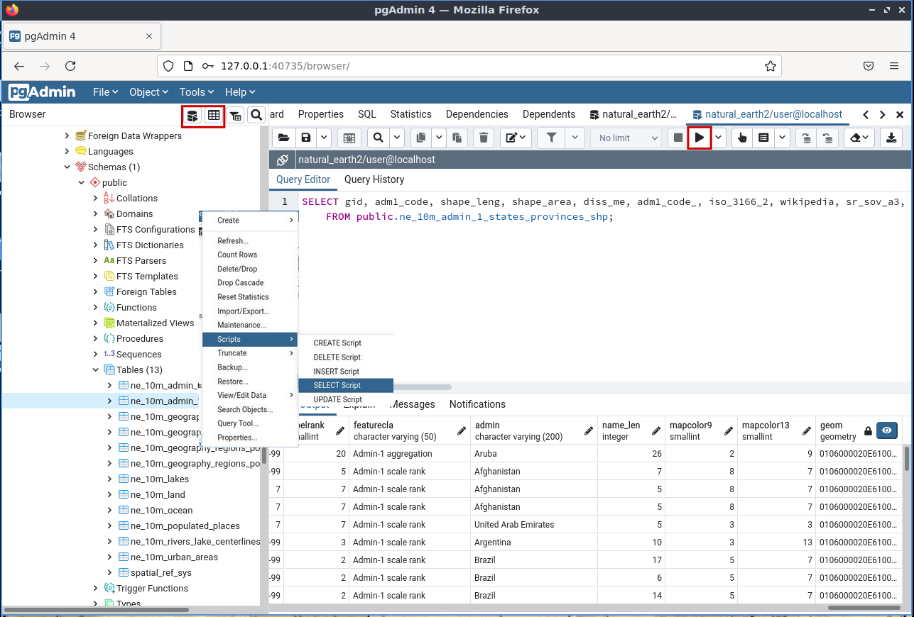

## How can you communicate with the database?

The communication with the database works via SQL - Structured Query Language.

* DDL - data definition language
* DML - data manipulation language
* DQL - data query language


### DQL

* DQL - to query your data (DQL is part of DML
) f.e to show all data from table spatial_ref_sys with srid = 4326

```sql
SELECT * FROM spatial_ref_sys WHERE srid=4326;
```

### DDL

* DDL to create database, table, user, schema and more

```sql
CREATE DATABASE demo;
```

* Connect to database demo by refreshing the list of databases and selecting "demo"

```sql
CREATE TABLE pois(
 gid serial PRIMARY KEY,
 name varchar,
 year int,
 info varchar
);
```

Modify your table

```sql
ALTER TABLE pois ADD COLUMN land varchar;
ALTER TABLE pois RENAME land TO country;
ALTER TABLE pois DROP COLUMN country;
```

Delete your table

```sql
DROP TABLE pois;
```

### DML

* manipulate your data - create data, delete data, change data

```sql
INSERT INTO pois (name, year, info) VALUES 
(
'Kölner Dom',
1248,
'https://en.wikipedia.org/wiki/Cologne_Cathedral'
);
```

```sql
UPDATE pois SET name = 'Cologne Cathedral' WHERE name = 'Kölner Dom';
```


```sql
--deletes feature with name "Cologne Cathedral"
DELETE FROM pois WHERE name = 'Cologne Cathedral';
-- deletes all data from table pois
DELETE FROM pois;
--deletes feature with gid = "1111"
DELETE FROM pois WHERE gid = 1111;
```

### Excercise 2: Create your own database with PostGIS extension

1. Create your own database with the name **_foss4g_**

Notice: Use lower case and no spaces as name for your database, tables columns! Makes live easier. As you do not have to use quotations - like "FOSS4G"

2. Change the connection and connect to your new database.

3. Load the extension **_postgis_** to your new database to be able to handle spatial data.

4. Check whether the postgis functions, **_spatial_ref_sys_** table and the metadata views are there


```sql
CREATE DATABASE foss4g;
```

Move to database **__foss4g_** (update the object browser, go to the database foss4g and open a new query editor)

```sql
CREATE EXTENSION postgis;
```


### Excercise 3: Use the utility program createdb to create a database via command line

* check the PostGIS Quickstart and see how the database demo was created
* https://live.osgeo.org/en/quickstart/postgis_quickstart.html
* PostgreSQL provides utility programs like **_createdb_** and **_dropdb_** to communicate with the database

Choose :menuselection:`Systems Tools --> LX Terminal` from menu to open a Terminal window.

```sql
createdb -U user -e demo
createdb --help

psql -U user demo
CREATE EXTENSION postgis;
\q

dropdb -U user demo
```

### Excercise 4: Create your own table cities

* create a new table **_cities_** with gid, name, country and geom (see poi example above)
* create a point for Florence Cathedral (Italy) with ST_MakePoint. 
* We take the coordinate of the Cathedral which is latitude 11.256944, longitude 43.773056 


* https://en.wikipedia.org/wiki/Florence_Cathedral
* https://en.wikipedia.org/wiki/Florence_Cathedral#/media/File:Florence_Duomo_from_Michelangelo_hill.jpg


```sql
CREATE TABLE cities(
 gid serial PRIMARY KEY,
 name varchar,
 country varchar,
 geom geometry(point,4326)
);
```

```sql
INSERT INTO cities(
            name, geom, country)
    VALUES ('Firenze',ST_SetSRID(ST_MakePoint(11.256944,43.773056),4326),'Italy');
```

```sql
INSERT INTO cities(
            name, geom, country)
    VALUES ('Buenos Aires',ST_SetSRID(ST_MakePoint(-58.394002,-34.581619),4326),'Argentina');
```

```sql
INSERT INTO cities(
            name, geom, country)
    VALUES ('Bucharest',ST_SetSRID(ST_MakePoint(26.096306 , 44.439663),4326),'Romania');
```

```sql
INSERT INTO cities(
            name, geom, country)
    VALUES ('Dar es Salaam',ST_SetSrid(ST_MakePoint(39.273933, -6.812810),4326),'Tanzania');
```

```sql
INSERT INTO cities(
            name, geom, country)
    VALUES ('Cologne',ST_SetSRID(ST_MakePoint(6.958307 , 50.941357),4326),'Germany');
```


### Well-Known Text Format (WKT) und Well-Known Binary Format (WKB) 

Geometries are stored in WKB format (Well-known Binary) which is not human readable. If you would like to see how the geometry looks like you can display them in the human readable WKT format (Well-known text).

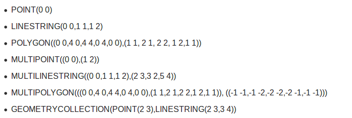

http://postgis.net/docs/using_postgis_dbmanagement.html#OpenGISWKBWKT


ST_AsEWKT or ST_AsText - to display the geometry as text

```sql
SELECT ST_AsText(geom), geom FROM cities; -- mit SRID
SELECT ST_AsEWKT(geom), geom FROM cities; -- ohne SRID
``` 

## QGIS to visualize your data

* You can visualize, edit and import/export data from a PostgreSQL/PostGIS database
* You need the information how to connect to the database - only authorized users can connect

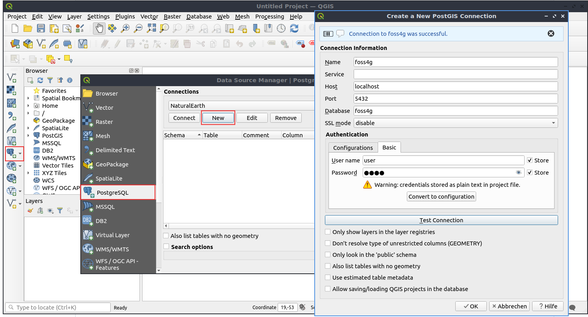


### Excercise 5: QGIS: Load data from **_natural_earth2_** and from your new database

1. Open QGIS. Choose :menuselection:`Geospatial --> Desktop QGIS --> QGIS Desktop` .
1. Load countries (table `ne_10m_admin_1_states_provinces_shp`) from the database natural_earth2
1. Create a new PostGIS connection to your new database foss4g
1. Load your new table cities
1. Add a new point to your cities table and mark the place where you come from (approximately)


## QGIS import data to PostgreSQL via QGIS DB Manager

You can use the QGIS DB Manager to import/export data to/from your database. You find the QGIS DB Manager in the menu at Database -> DB Manager. You need a connection to the PostgreSQL database that you would like to use.

Best way is to add the data you would like to import to a QGIS project. You can filter the data if you only want to import a subset of your data. 

To import data you have to follow the steps:

1. Open the DB Manager
1. Connect to your database
1. Use the Import layer/file button
1. Choose your data for import
1. define a name for your table, the SRID, add a primary key (gid recommended)
1. Create a spatial index
1. Start the import
1. Add the imported data via drag & drop to your QGIS project

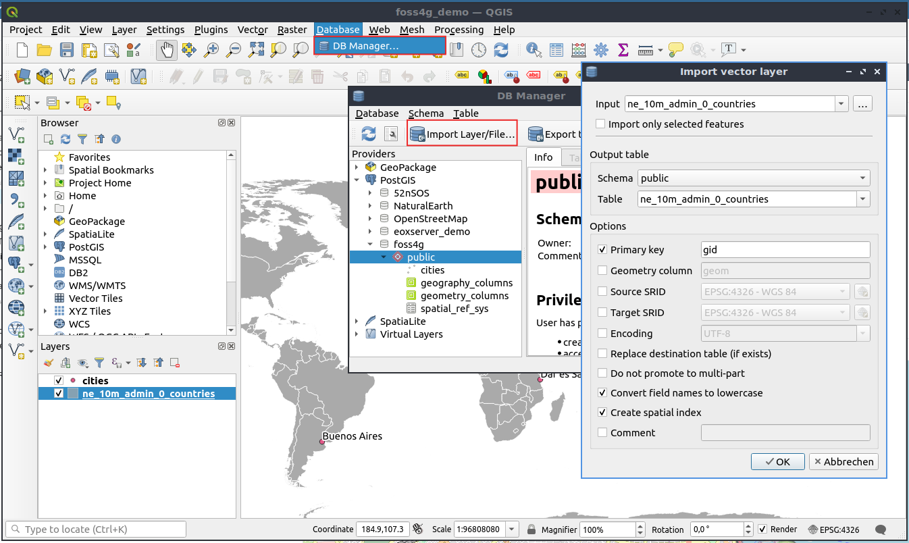


### Excercise 6: Load data from natural_earth2 shapes to your database

* You find the natural_earth2 data at /home/user/data/natural_earth2/
* Import ne_10m_admin_0_countries.shp to table **_ne_10m_admin_0_countries_**
* Import ne_10m_admin_1_states_provinces_shp.shp to table **_ne_10m_admin_1_states_provinces_shp_**
* Also import only the provinces from Italy to **_table provinces_italy_** (in QGIS use Filter "admin" = 'Italy')
* Import all ne_10m_populated_places to table **_ne_10m_populated_places_**
* Have a look to your metadata view **_geometry_columns_**


## QGIS: Create your table via QGIS

It is very easy to create new tables with spatial data with QGIS. 
This is done with the QGIS DB Manager. Choose the menu item **_Table -> Create table_**. 
You can define a unique id, add colummns and define the geometry column.


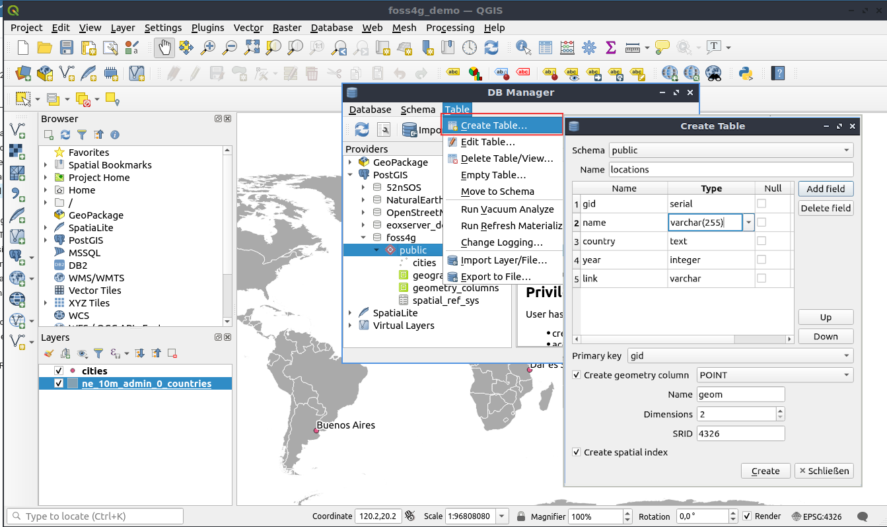


### Excercise 7: Create a table named locations via QGIS

* Create a new table in your database **_foss4g_** via QGIS named **_locations_**. This table shall store a point for each city where FOSS4G took place. 
* The table needs a unique id, a column for the city name, maybe a column for the country name, a column for the year and a link to the website. 
And do not miss a geometry column (POINT, SRID 4326). 
* Also create a Spaltial Index on creation of the table.
* Now you can start editing. You can add a point to this layer for Buenos Aires and add the additional information.
* Now have a look at your new table with pgAdmin.

Note: It is so easy to create tables in your database without using SQL.


## Get to know PostGIS functions

* PostGIS Documentation http://postgis.net/docs/
* PostGIS Vector Functions see Chapter 8: http://postgis.net/docs/reference.html


### Geometry Constructors

* there are many functions to create geometries see Geometry Constructors
* http://postgis.net/docs/reference.html#Geometry_Constructors
* we used ST_MakePoint already - 2D, 3DZ or 4D is possible http://postgis.net/docs/ST_MakePoint.html

ST_GeomFromText - can be used for different geometry types
* http://postgis.net/docs/ST_GeomFromText.html
* http://postgis.net/docs/using_postgis_dbmanagement.html#OpenGISWKBWKT

```sql
Update cities 
  set geom = ST_GeomFromText('POINT(6.958307 50.941357)',4326) 
  WHERE name = 'Cologne';
```

```sql
Update ne_10m_admin_0_countries 
set geom = ST_GeomFromText('MULTIPOLYGON(((0 0,4 0,4 4,0 4,0 0),(1 1,2 1,2 2,1 2,1 1)), ((-1 -1,-1 -2,-2 -2,-2 -1,-1 -1)))',4326) 
WHERE name = 'United Kingdom';
```
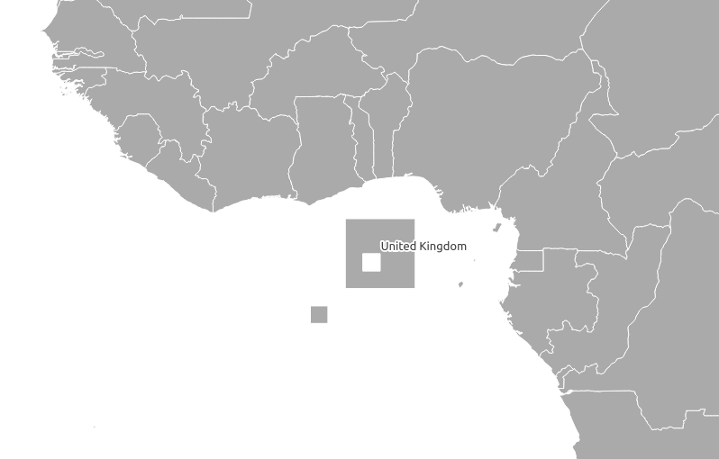

## Spatial Relationships and Measurements

* get information about your data f.e. distance, area, length, centroid


### Excercise 8: Calculate the area for each country

* http://postgis.net/docs/ST_Area.html
* Note that the area is calculated using the srid of the geometry. Use the calculation on the spheroid to get the result in meters.

Calculate area without using the spheroid (units of the projection will be used)
```sql
SELECT gid, name, st_Area(geom)
  FROM public.ne_10m_admin_0_countries;
```

Calculate area using the Spheroid (result in squaremeters)
```sql
SELECT gid, name, st_Area(geom, true) 
  FROM public.ne_10m_admin_0_countries;
```
Calculate area from Germany and Italy order by area
```sql
SELECT gid, name, round(ST_Area(geom, true)) as area
  FROM public.ne_10m_admin_0_countries
  WHERE name IN ('Germany','Italy') 
  ORDER BY area DESC;
```

### Excercise 9: Create a view with the centroid for each country

* Create a view with the centroid for each province
* Try to load the view in QGIS
* Have a look at your geometry_columns view
* Check where the centroid of France is and the centroid of Italy.


```sql
CREATE VIEW qry_country_centroid AS
SELECT gid, name, st_centroid(geom)
  FROM public.ne_10m_admin_0_countries;
```

Recreate the view and typecast your geometry column to point 

```sql
Drop view qry_country_centroid;
CREATE VIEW qry_country_centroid AS
SELECT gid, name, st_centroid(geom)::geometry(point,4326) as geom
  FROM public.ne_10m_admin_0_countries;
```


### Excercise 10: Calculate the distance

* How many and which centroids are not on the country polygon? 

```sql
SELECT c.gid, 
  c.name, 
  ST_Distance (p.geom, c.geom, true), 
  c.geom, p.geom
  FROM qry_country_centroid p,
  ne_10m_admin_0_countries c
  WHERE 
    ST_Distance (p.geom, c.geom) > 0
    AND p.gid = c.gid
```

* get back to your cities table from **_Excercise 4_**. Calculate the distance between Firenze and your home town.
* use the spheroid for your calculations (use geography)
* https://postgis.net/docs/ST_Distance.html

```sql
SELECT g.name, you.name, ST_Distance(g.geom, you.geom, true) 
  FROM cities g, 
  cities you 
  WHERE 
    g.name = 'Firenze' 
    AND you.name='Cologne';
```

* Question: Who had the longest distance to travel to Firenze?

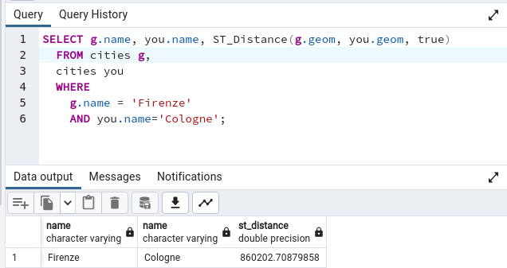

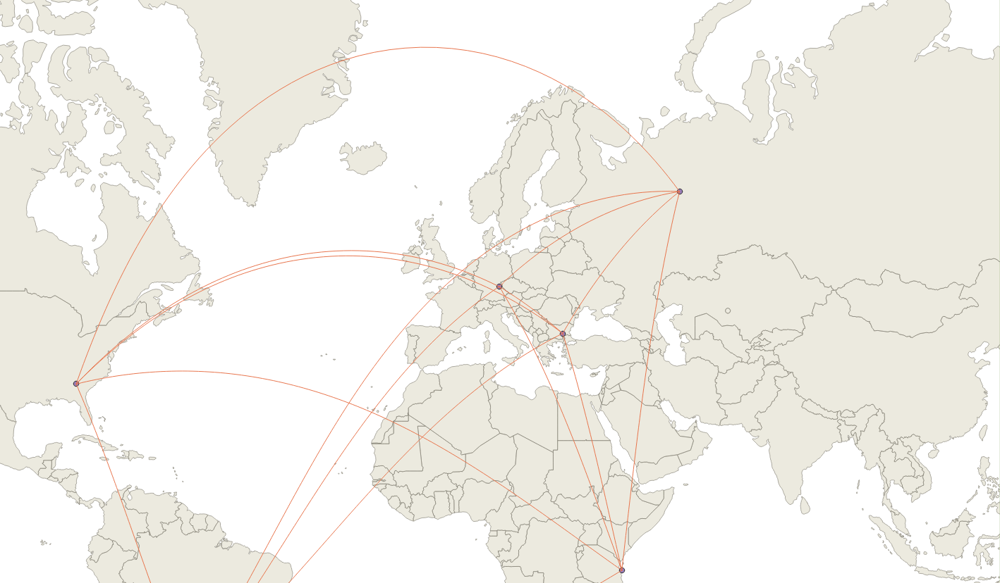

## Spatial Index and functional Index

* Your geometry column should have an index - can make your spatial queries faster
* the bounding box for every geometry will be stored in the index 
* you also can create a functional index - f.e. with ST_Transform

```sql
CREATE INDEX gist_cities_geom
 ON cities 
 USING GIST (geom);
```

```sql
CREATE INDEX gist_cities_geom
  ON cities 
  USING GIST (ST_Transform(geom,25832));
```


## Geometry Processing

* There are many functions for geometry processing f.e. buffering, intersection, union, subdivide
* http://postgis.net/docs/reference.html#Geometry_Processing

### Exercise 11: Buffer populated places with 10 km

* 
* Buffer the table ne_10m_populated_places with 10 km
* http://postgis.net/docs/ST_Buffer.html
* Note that you have to use geography to create a buffer in meter - use typecast ::geography

```sql
CREATE TABLE places_buffer_10_km as
SELECT 
  gid, 
  name, 
  ST_Buffer(geom::geography, 10000)::geometry(polygon,4326) as geom 
  FROM public.ne_10m_populated_places;
```

```sql
SELECT a.* 
  FROM places_buffer_10_km a, places_buffer_10_km b
  WHERE a.geom && b.geom 
  AND ST_Intersects(a.geom, b.geom) 
  AND a.gid != b.gid;
```

```sql
CREATE INDEX gist_places_buffer_10_km_geom
  ON places_buffer_10_km 
  USING GIST (geom);
```

Run the query again and check whether the index is used.

```sql
SELECT a.* 
  FROM places_buffer_10_km a, places_buffer_10_km b
  WHERE
  ST_Intersects(a.geom, b.geom) 
  AND a.gid != b.gid
```

```sql
EXPLAIN ANALYZE
SELECT a.* 
  FROM places_buffer_10_km a, places_buffer_10_km b
  WHERE
  ST_Intersects(a.geom, b.geom) 
  AND a.gid != b.gid
```


### Exercise 12: ST_Union - union all provinces from country Italy to one area 

* Have a look at the provinces from Italy and order them by size
* Create a view called qry_italy_union
* use ST_UNION http://postgis.net/docs/ST_Union.html
* use table ne_10m_admin_1_states_provinces_shp and filter by admin Italy
* add column admin to your view (admin='Italy') - you have to use GROUP BY 
* typecast the geomety column
* have a look at your result with QGIS

Step 1: Have a look at the provinces from Italy

```sql
SELECT gid, name, admin, geom, 
  round(ST_Area(geom, true)) as area,
  RANK() over (order by ST_Area(geom, true) desc)
  FROM ne_10m_admin_1_states_provinces_shp 
  WHERE admin='Italy'
  ORDER BY area DESC;
```

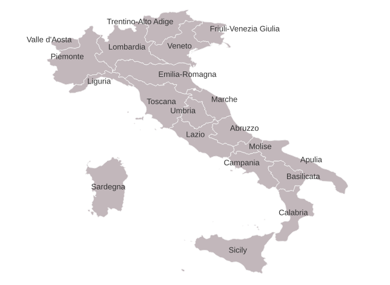

Step 2: Union all provinces from Italy via ST_UNION

```sql
SELECT ST_Union(geom)
  FROM public.ne_10m_admin_1_states_provinces_shp 
  WHERE admin='Italy';
```

Step 3: Add a row number and display the geometry as text

```sql
SELECT ROW_NUMBER() OVER () as gid, 
  admin, 
  st_AsText(ST_Union(geom))
  FROM public.ne_10m_admin_1_states_provinces_shp 
  WHERE admin='Italy'
  GROUP BY admin ;
```

Step 4: Create a view. Assign the geometry type and projection to the new geom, add column admin (use GROUP BY)

```sql
CREATE VIEW qry_italy_union AS
SELECT ROW_NUMBER() OVER () as gid, 
  admin, 
  ST_UNION(geom::geometry(multipolygon,4326)) as geom
  FROM public.ne_10m_admin_1_states_provinces_shp 
  WHERE admin='Italy'
  GROUP BY admin ;
```

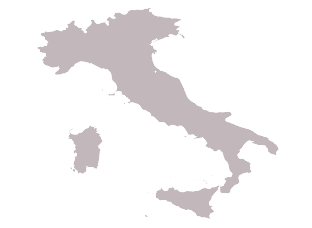


### ST_Subdivide

* Divides a Multi-/Polygon in multiple smaller Polygons
* Define max_vertices (default is 256, can't be < 8)
* Try with definition of max_vertices: Object should not have more than 20 max_vertices
* http://postgis.net/docs/ST_Subdivide.html
* From PostGIS 2.3.0

```sql
CREATE TABLE provinces_subdivided AS 
  SELECT 
  name, 
  admin, 
  ST_Subdivide(geom) AS geom
  FROM ne_10m_admin_1_states_provinces_shp;

ALTER TABLE provinces_subdivided ADD COLUMN gid serial PRIMARY KEY;
```

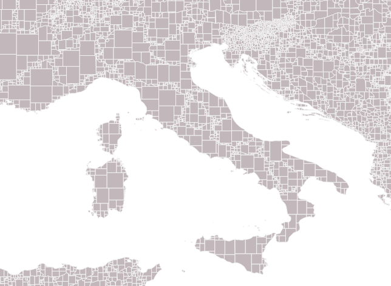

* with definition of max_vertices (default is 256, not < 8)

```sql
DROP TABLE provinces_subdivided;
CREATE TABLE provinces_subdivided AS 
  SELECT 
  name, 
  admin, 
  st_subdivide(geom,20) AS geom
  FROM ne_10m_admin_1_states_provinces_shp ;

ALTER TABLE provinces_subdivided ADD COLUMN gid serial PRIMARY KEY;
```


```sql
CREATE INDEX provinces_subdivided_geom_gist
  ON provinces_subdivided
  USING gist
  (geom);

VACUUM ANALYZE provinces_subdivided;
```

### Excercise 13: ST_Subdivide

* Sometimes it makes sense to divide huge geometries in smaller parts to get faster calculations
* This example should show the use 
* Create a new function **_getCountrynameSubdivided()_** for table provinces_subdivided
* Have a look at EXPLAIN to check the performance

```sql
CREATE OR REPLACE FUNCTION getCountrynameSubdivided(mygeometry geometry) 
 RETURNS character varying 
 AS 'SELECT c.name FROM provinces_subdivided c 
 WHERE st_intersects(c.geom,$1);' 
LANGUAGE 'sql'; 
```

```sql
SELECT name, getCountrynameSubdivided(geom) 
 FROM public.ne_10m_populated_places 
 WHERE adm0name = 'Italy';
```

```sql
EXPLAIN ANALYZE
SELECT name, getCountrynameSubdivided(geom) 
 FROM public.ne_10m_populated_places 
 WHERE adm0name = 'Italy';
```


```sql
ALTER TABLE ne_10m_populated_places ADD COLUMN countryname varchar;

UPDATE ne_10m_populated_places 
SET countryname = getCountrynameSubdivided(geom);
```

Function, that uses the original province polygons

```sql
CREATE OR REPLACE FUNCTION getCountryname(mygeometry geometry) 
 RETURNS character varying 
 AS 'SELECT c.name FROM ne_10m_admin_1_states_provinces_shp c 
 WHERE st_intersects(c.geom,$1);' 
LANGUAGE 'sql'; 
```

```sql
EXPLAIN ANALYZE
SELECT name, getCountryname(geom) 
 FROM public.ne_10m_populated_places;
```

## PostgreSQL Foreign Data Wrapper

You can connect from your database to other data sources via Foreign Data Wrapper (FDW). There are several Foreign Data Wrapper available see https://wiki.postgresql.org/wiki/Foreign_data_wrappers.

To connect to another PostgreSQL database you can use the PostgreSQL FDW via the Extension postgres_fdw.

- Note: PostgreSQL OGR Foreign Data Wrapper might be also interesting for you as it offers access to a large number of formats https://github.com/pramsey/pgsql-ogr-fdw 

You have to 
1. load the extension
1. create a foreign server
1. add a user mapping 
1. import foreign tables 

Then you can access the tables from the foreign database easily. 

### Excercise 14: Create a Foreign Data Wrapper to the database osm_local

1. load extension postgres_fdw
1. create a foreign server to osm_local
1. create a user mapping for user **_user_**
1. Import all tables except spatial_ref_sys, geometry_columns, geography_columns
1. find out which bars/pubs are close to the Firenze Cathedral (see your table cities)  

Step 1-4: 

```sql
CREATE EXTENSION postgres_fdw;

CREATE SERVER pg_fdw_osm_local
 FOREIGN DATA WRAPPER postgres_fdw 
 OPTIONS (host 'localhost', dbname 'osm_local', port '5432');

CREATE USER MAPPING FOR user SERVER pg_fdw_osm_local 
 OPTIONS (user 'user', password 'user');

IMPORT FOREIGN SCHEMA public
  EXCEPT (spatial_ref_sys, geometry_columns, geography_columns)
    --[ { LIMIT TO | EXCEPT } ( table_name [, ...] ) ]
    FROM SERVER pg_fdw_osm_local 
    INTO public;
```

Use KNN (K nearest neighbor) to find the 5 closest pubs/bars from the Firenze Cathedral (see table cities)  

```sql  
CREATE VIEW qry_next_5_bars as   
SELECT p.osm_id, p.name, p.amenity, p.way as geom 
 FROM cities c,
 planet_osm_point p
  WHERE p.amenity IN ( 'bar' , 'pub')
   AND c.name = 'Firenze'
    ORDER BY
    c.geom <-> p.way
    LIMIT 5;
```

Use KNN (K nearest neighbor) to find the pubs/bars less then 1 km distance from the Firenze Cathedral (see table cities)  


```sql
CREATE VIEW qry_next_bars_1000 as   
SELECT p.osm_id, p.name, p.amenity, p.way as geom 
 st_distance(c.geom, p.way, true)
 FROM cities c,
 planet_osm_point p
  WHERE p.amenity IN ( 'bar' , 'pub')
   AND c.name = 'Firenze'
   AND st_distance(c.geom, p.way, true) < 1000
    ORDER BY
    c.geom <-> p.way;
```


Create the 1 km buffer around the Cathedral.

```sql
CREATE view qry_buffer_cathedral_1000 as
 SELECT gid, st_buffer(geom::geography,1000)::geometry as geom 
  FROM cities 
   WHERE name = 'Firenze'
```


Create an intersection between the buffer area and the OSM buildings.

```sql
CREATE view qry_intersection_buffer_1000_buildings as
SELECT p.osm_id, p.way as geom, 
 p.name,
 p.building, 
 ST_Intersection(p.way, s.geom)::geometry(polygon,4326) geom_intersection
 FROM 
 planet_osm_polygon p,
 qry_buffer_cathedral_1000 s
  WHERE 
  p.building IS NOT NULL AND
  ST_Intersects(p.way, s.geom)
```

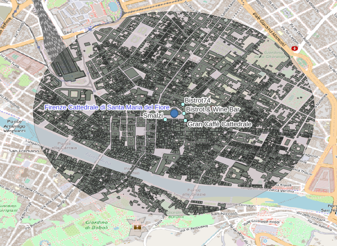


## PostgreSQL Roles and controlled access

PostgreSQL allows you to create roles (user with login and user without login) and also groups. 
These roles can have different power and get access via GRANT to different objects of your database - f.e a table. 

* See CREATE ROLE: https://www.postgresql.org/docs/current/static/sql-createrole.html
* See GRANT https://www.postgresql.org/docs/current/static/sql-grant.html


### Example 15: Create roles and grant access    

#. Create a role workshop_read and workshop_writer
#. Create a login role robert with a password and add to workshop_reader
#. Create a new login role wilma and add wilma to the workshop_writer role
#. Grant read access to table ne_10m_admin_1_states_provinces_shp to your new role workshop_reader
#. Grant write access to table cities to your new role workshop_writer 
#. Try to access and edit via QGIS 

```sql
CREATE ROLE workshop_reader;
CREATE ROLE workshop_writer;

CREATE ROLE robert WITH LOGIN PASSWORD 'foss4g';
GRANT workshop_reader TO robert;

CREATE ROLE wilma WITH LOGIN PASSWORD 'foss4g';
GRANT workshop_writer TO wilma;

GRANT SELECT ON ne_10m_admin_1_states_provinces_shp TO workshop_reader;
-- change to user robert
Select * from ne_10m_admin_1_states_provinces_shp;

-- this command will return an error. Role robert isn't allowed to modify data.
SELECT * from ne_10m_admin_1_states_provinces_shp;
UPDATE ne_10m_admin_1_states_provinces_shp SET name = 'TEST' WHERE name = 'Toscana';

--ERROR:  permission denied for relation ne_10m_admin_1_states_provinces_shp

GRANT ALL ON cities to workshop_writer;
GRANT USAGE ON SEQUENCE cities_gid_seq TO workshop_writer;

-- change to user wilma in pgAdmin
-- Run the following SQL
SELECT * from cities;
UPDATE cities SET name = 'TEST' WHERE name = 'Firenze';
```

## What is coming next?

- PostGIS raster https://postgis.net/docs/RT_reference.html
- PostGIS point cloud https://pgpointcloud.github.io/pointcloud/
- PostGIS 3D https://postgis.net/docs/reference.html#reference_sfcgal
- pgRouting https://pgrouting.org/
- MobilityDB https://github.com/MobilityDB/MobilityDB
- pg_featureserv PostGIS-only Feature Server https://access.crunchydata.com/documentation/pg_featureserv/latest/
- pg_tileserv PostGIS-only Tile Server https://access.crunchydata.com/documentation/pg_tileserv/latest/

